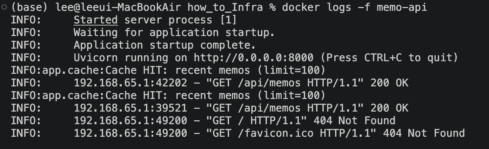
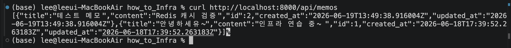
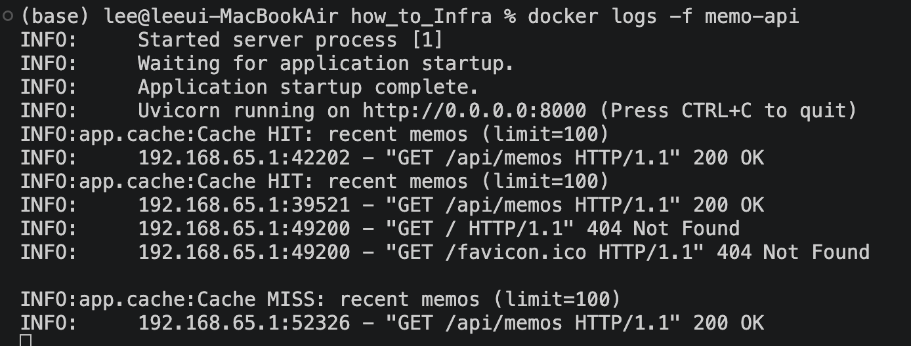
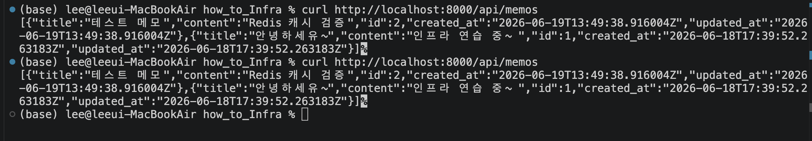
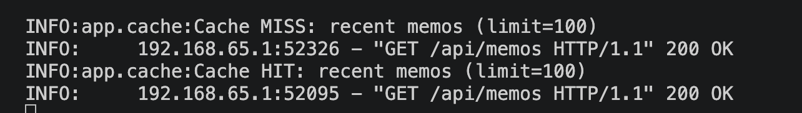

### 캐싱 확인


### ① [1차 요청] 데이터베이스에서 읽어오기 (Cache MISS)





### ② [2차 요청] 메모리에서 바로 읽어오기 (Cache HIT)





---

# 2단계: Docker + Redis 캐싱

## 수행 내용

- **Redis 연동**: `backend/app/cache.py`에서 캐시 읽기/쓰기/무효화 처리
- **라우터 적용**: `routers/memos.py`에서 조회 시 캐시 우선, CUD 시 무효화
- **컨테이너화**: `backend/Dockerfile` + `docker-compose.yml` (db, redis, app)

## 캐시 설계

| 키 | 대상 | TTL |
|----|------|-----|
| `memo:{id}` | 개별 메모 상세 | 300초 |
| `memos:recent:{limit}` | 최근 메모 목록 (`skip=0`) | 300초 |

**조회 흐름**

1. Redis에서 키 조회 → 있으면 **Cache HIT**, DB 접근 없이 반환
2. 없으면 **Cache MISS** → DB 조회 후 JSON으로 Redis에 저장

**무효화**

| 동작 | 처리 |
|------|------|
| POST (생성) | 최근 목록 캐시 삭제 + 새 메모 캐시 저장 |
| PUT (수정) | 해당 메모 + 최근 목록 캐시 삭제 후 재저장 |
| DELETE (삭제) | 해당 메모 + 최근 목록 캐시 삭제 |

목록은 `updated_at` 내림차순(최근 메모 우선)으로 조회합니다.

## Docker 구성

```
docker-compose.yml
├── db      PostgreSQL
├── redis   Redis 7
└── app     FastAPI (backend/Dockerfile 빌드)
```

컨테이너 간 통신: `REDIS_URL=redis://redis:6379/0`, `DATABASE_URL=...@db:5432/...`

## 실행 및 확인

```bash
docker compose up -d --build
curl http://localhost:8000/api/memos      # 1차 MISS → 2차 HIT
curl http://localhost:8000/api/memos/1
docker logs memo-api                      # Cache HIT / MISS 로그 확인
```

- Health: `GET /health` → `{"status":"ok","redis":"ok"}`
