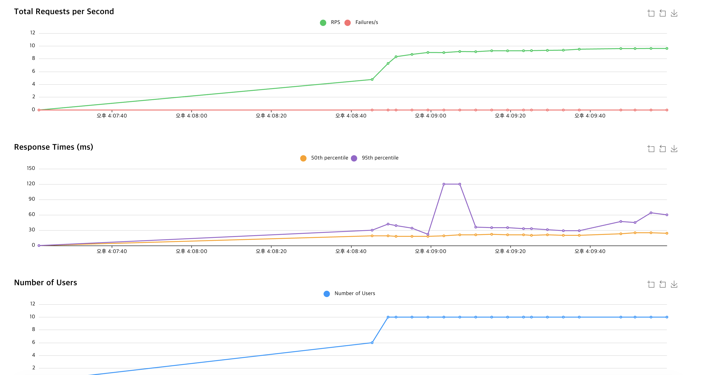
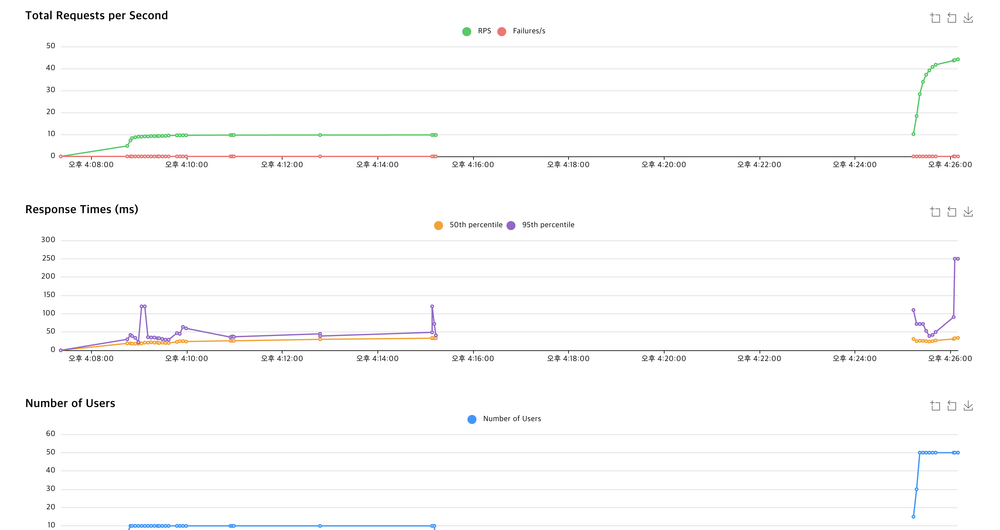
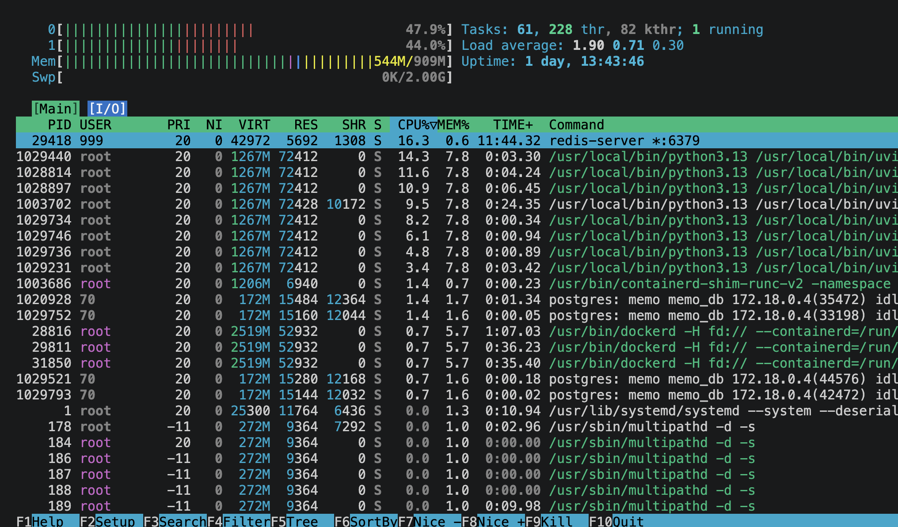
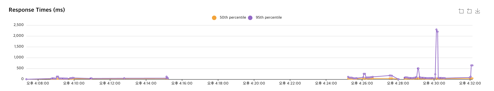
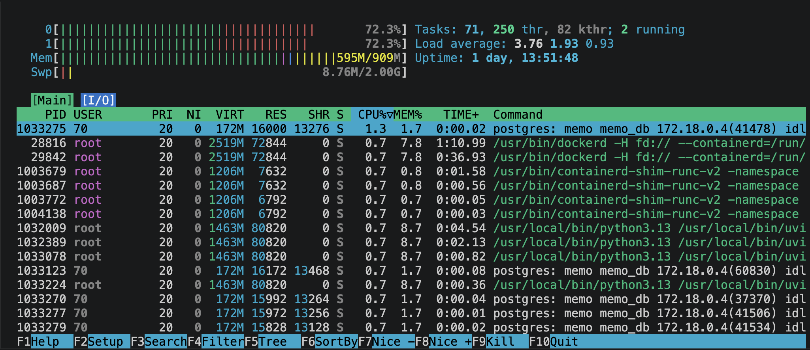
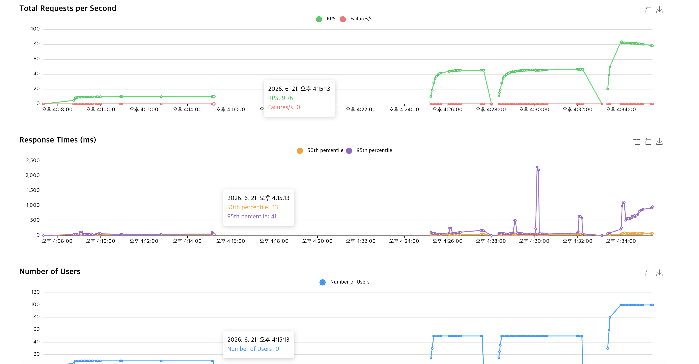
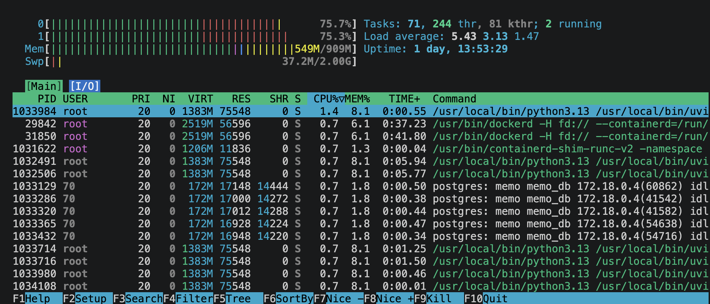

# 5단계: 부하 테스트 및 최적화 검증

## 테스트 목적

동시 접속자 증가에 따른 서버 한계를 측정하고, **Redis 캐시**·**Gunicorn 멀티 워커** 도입 전후 성능 변화를 수치로 검증합니다.

## 테스트 환경

| 항목 | 값 |
|------|-----|
| 인스턴스 | AWS EC2 t2.micro (vCPU 1, RAM 1GB) |
| OS | Ubuntu 24.04 LTS |
| Swap | 2.0 GiB (OOM 방지) |
| 부하 도구 | Locust (Headless / Web UI) |
| 대상 API | `GET /api/memos`, `GET /api/memos/{id}` |

## 시나리오별 결과 (Users 50~100)

| # | 시나리오 | RPS | 평균(ms) | p95(ms) | 실패율 | htop 관측 |
|---|----------|-----|----------|---------|--------|-----------|
| ① | 50명 / Redis ON / Uvicorn 1 | ~47 | 수십 ms | 매우 낮음 | 0% | CPU 20~30%, RAM 안정 |
| ② | 50명 / Redis OFF / Uvicorn 1 | ~44 | 지연 발생 | **2,300** | 0% | DB 병목으로 순간 지연 폭발 |
| ③ | 100명 / Redis ON / Uvicorn 1 | ~80 | 100~300 | ~1,000 | 0% | CPU 74%, Swap 8.29M 최초 사용 |
| ④ | 100명 / Redis ON / Gunicorn 4 | **120~140** | 50~100 | 100~200 | 0% | CPU 100%, 처리량 **~50%↑** |

### 임계점 관측 (④ Gunicorn 4 워커)

- 초반: p95 **100~200ms**, RPS **140**까지 상승
- 후반: t2.micro 1코어 한계 → CPU 100% 장시간 지속 → 요청 큐 대기 + AWS CPU 크레딧 고갈 → p95 **1,000ms+** 스파이크
- **결론**: 소프트웨어 튜닝만으로는 1코어 물리 한계를 넘기 어려움

## 핵심 회고

### Redis 캐시 (ON vs OFF)

- **현상**: 50명 규모에서 Redis OFF 시 p95 **2.3초**까지 지연
- **원인**: 매 요청마다 PostgreSQL 디스크 I/O 발생
- **결론**: Redis 인메모리 캐시로 Latency 스파이크 원천 차단

### Gunicorn 멀티 워커

- **현상**: Uvicorn 단일 프로세스 → 100명 부하 시 CPU 74%에서 병목, p95 ~1초
- **개선**: Gunicorn 4 워커 → CPU 100% 활용, RPS **~50% 향상**, p95 **5배 단축**
- **결론**: 추가 비용 없이 소프트웨어 아키텍처만으로 가성비 최적화 달성

### Linux Swap

- **현상**: 100명 부하에서 RAM 1GB 초과해도 서버 다운 없음
- **관측**: Swap ~129MB 사용, 실패율 **0%**
- **결론**: OOM 방어용 Swap 2GB 구성이 유효

## 테스트 스크린샷

### 5명 (기준)



### 50명





### Redis OFF



### 100명







## 향후 고도화

현재 가능한 소프트웨어 최적화(Redis + Gunicorn + Swap)는 완료. **200~500명+** 트래픽 대비:

- **Scale-up**: t2.medium 이상 인스턴스
- **Scale-out**: ALB + EC2 다중 인스턴스 분산

## 재현 방법

```bash
pip install -r requirements-locust.txt

# 워커 수 변경 후 테스트
GUNICORN_WORKERS=1 docker compose up -d --build app
locust --host http://[퍼블릭 IP]:8000 --headless -u 100 -r 10 -t 60s MemoReader

GUNICORN_WORKERS=4 docker compose up -d --build app
./scripts/compare-gunicorn-workers.sh http://[퍼블릭 IP]:8000
```

Redis OFF 비교: `docker stop memo-redis` 후 동일 조건 재테스트
